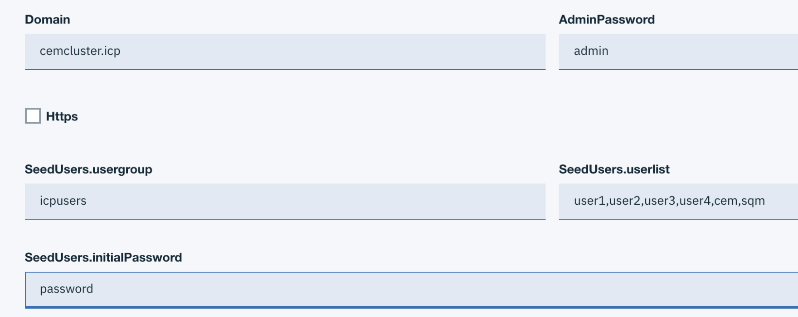

# Installing openLDAP
##	Package and load openLDAP
Clone https://github.com/ibm-cloud-architecture/icp-openldap
```
[root@icp3m1 ~]# mkdir git
[root@icp3m1 ~]# cd git
[root@icp3m1 git]# git clone https://github.com/ibm-cloud-architecture/icp-openldap
Cloning into 'icp-openldap'...
remote: Enumerating objects: 21, done.
remote: Counting objects: 100% (21/21), done.
remote: Compressing objects: 100% (13/13), done.
remote: Total 41 (delta 8), reused 16 (delta 8), pack-reused 20
Unpacking objects: 100% (41/41), done.
```
Login to ICP
```[root@icp3m1 git]# cloudctl login -a https://172.16.254.88:8443 -u admin -n kube-system --skip-ssl-validation

Password>
Authenticating...
OK

Targeted account cemcluster Account (id-cemcluster-account)

Targeted namespace kube-system

Configuring kubectl ...
Property "clusters.cemcluster" unset.
Property "users.cemcluster-user" unset.
Property "contexts.cemcluster-context" unset.
Cluster "cemcluster" set.
User "cemcluster-user" set.
Context "cemcluster-context" created.
Switched to context "cemcluster-context".
OK

Configuring helm: /root/.helm
OK
```
Package to helm, note for first time use, helm init –client-only need to be performed.  The –client-only will not deploy tiller in the server.
```[root@icp3m1 git]# helm package icp-openldap
Successfully packaged chart and saved it to: /root/git/icp-openldap-0.1.5.tgz
Error: stat /root/.helm/repository/local: no such file or directory

[root@icp3m1 git]# helm init --client-only
Creating /root/.helm/repository
Creating /root/.helm/repository/cache
Creating /root/.helm/repository/local
Creating /root/.helm/plugins
Creating /root/.helm/starters
Creating /root/.helm/cache/archive
Creating /root/.helm/repository/repositories.yaml
Adding stable repo with URL: https://kubernetes-charts.storage.googleapis.com
Adding local repo with URL: http://127.0.0.1:8879/charts
$HELM_HOME has been configured at /root/.helm.
Not installing Tiller due to 'client-only' flag having been set
Happy Helming!

[root@icp3m1 git]# helm package icp-openldap
Successfully packaged chart and saved it to: /root/git/icp-openldap-0.1.5.tgz

Upload the helm to the server.
[root@icp3m1 git]# cloudctl catalog load-chart --archive icp-openldap-0.1.5.tgz
Loading helm chart
Loaded helm chart

Synch charts
Synch started
OK
[root@icp3m1 git]#
```
Check the catalog in ICP.
`Menu > Manage > Helm Repositories`
Then go to Catalog and search for ldap


## Deploy openLDAP

Make sure you are happy with the
•	admin password :“admin”
•	user: mcm, cem, user1, user2, user3, user4
•	user password: password
•	group: icpusers
•	Domain: cemcluster.icp

We can change the default values in the yaml.

Click Install.  Then click the pop-up windows.

2 pods are running, good.

Note the 2 services: ldap service and admin service.


### Exec to the ldap pod.
Exec into the ldap pod and perform an LDAPsearch to ensure that the user are created in LDAP.
Also note certain ObjectID as they will be needed in the LDAP Connection configuration in ICP.

```
[root@icp3m1 ~]# kx openldap-rel-6fbcc4c856-b9l69 bash
root@openldap-rel-6fbcc4c856-b9l69:/#

ldapsearch -x -h localhost -b dc=cemcluster,dc=icp -D "cn=admin,dc=cemcluster,dc=icp" -w admin

# extended LDIF
#
# LDAPv3
# base <dc=cemcluster,dc=icp> with scope subtree
# filter: (objectclass=*)
# requesting: ALL
#

# cemcluster.icp
dn: dc=cemcluster,dc=icp
objectClass: top
objectClass: dcObject
objectClass: organization
o: Example Inc.
dc: cemcluster

# admin, cemcluster.icp
dn: cn=admin,dc=cemcluster,dc=icp
objectClass: simpleSecurityObject
objectClass: organizationalRole
cn: admin
description: LDAP administrator
userPassword:: e1NTSEF9WHF3NGM4WmpseEpsc0VKUnZFY1d0eEJybmZlWmYvOTQ=

# Groups, cemcluster.icp
dn: ou=Groups,dc=cemcluster,dc=icp
objectClass: organizationalUnit
ou: Groups

# People, cemcluster.icp
dn: ou=People,dc=cemcluster,dc=icp
objectClass: organizationalUnit
ou: People

# user1, People, cemcluster.icp
dn: uid=user1,ou=People,dc=cemcluster,dc=icp
objectClass: inetOrgPerson
objectClass: organizationalPerson
objectClass: person
objectClass: top
uid: user1
displayName: user1
sn: user1
cn: user1
userPassword:: cGFzc3dvcmQ=

# user2, People, cemcluster.icp
dn: uid=user2,ou=People,dc=cemcluster,dc=icp
objectClass: inetOrgPerson
objectClass: organizationalPerson
objectClass: person
objectClass: top
uid: user2
displayName: user2
sn: user2
cn: user2
userPassword:: cGFzc3dvcmQ=

# user3, People, cemcluster.icp
dn: uid=user3,ou=People,dc=cemcluster,dc=icp
objectClass: inetOrgPerson
objectClass: organizationalPerson
objectClass: person
objectClass: top
uid: user3
displayName: user3
sn: user3
cn: user3
userPassword:: cGFzc3dvcmQ=

# user4, People, cemcluster.icp
dn: uid=user4,ou=People,dc=cemcluster,dc=icp
objectClass: inetOrgPerson
objectClass: organizationalPerson
objectClass: person
objectClass: top
uid: user4
displayName: user4
sn: user4
cn: user4
userPassword:: cGFzc3dvcmQ=

# cem, People, cemcluster.icp
dn: uid=cem,ou=People,dc=cemcluster,dc=icp
objectClass: inetOrgPerson
objectClass: organizationalPerson
objectClass: person
objectClass: top
uid: cem
displayName: cem
sn: cem
cn: cem
userPassword:: cGFzc3dvcmQ=

# sqm, People, cemcluster.icp
dn: uid=sqm,ou=People,dc=cemcluster,dc=icp
objectClass: inetOrgPerson
objectClass: organizationalPerson
objectClass: person
objectClass: top
uid: sqm
displayName: sqm
sn: sqm
cn: sqm
userPassword:: cGFzc3dvcmQ=

# icpusers, Groups, cemcluster.icp
dn: cn=icpusers,ou=Groups,dc=cemcluster,dc=icp
cn: icpusers
objectClass: groupOfUniqueNames
objectClass: top
owner: cn=admin,dc=cemcluster,dc=icp
uniqueMember: uid=user1,ou=People,dc=cemcluster,dc=icp
uniqueMember: uid=user2,ou=People,dc=cemcluster,dc=icp
uniqueMember: uid=user3,ou=People,dc=cemcluster,dc=icp
uniqueMember: uid=user4,ou=People,dc=cemcluster,dc=icp
uniqueMember: uid=cem,ou=People,dc=cemcluster,dc=icp
uniqueMember: uid=sqm,ou=People,dc=cemcluster,dc=icp

# search result
search: 2
result: 0 Success

# numResponses: 12
# numEntries: 11
root@openldap-rel-6fbcc4c856-b9l69:/#
```
## Create ICP LDAP Connection
###	Get the LDAP Connection Detail:


###	Get the LDAP objectclass

From the export above, note the LDAP object class

```
Base DN: dc=cemcluster,dc=icp
Bind DN: cn=admin,dc=cemcluster,dc=icp
LDAP server URL: ldap://10.0.237.212:389
Group Filter: (&(cn=%v)(objectclass=groupOfUniqueNames))
Group ID map: *:cn
Group member ID map: groupOfUniqueNames:uniquemember
User filter: (&(uid=%v)(objectclass=inetOrgPerson))
User ID map: *:uid
```

###	Create the LDAP connection

`Menu > Manage > Identity & Access > Authentication`
Create LDAP connection:

Click Test Connection.

Note, the BindDN has to be in the format: `cd=admin,dc=cemcluster,dc=icp`


Need to change the user filter to `inetOrgPerson` from `ePerson`.

##	Create Teams
Once we got the LDAP Connection detail defined, we are ready to create team.
`Menu > Manage > Identity & Access > Teams`

###	Create team


###	Add User to the team


###	Add the resources (namespace, helm repository, directory)


###	Test
Test by logging out and logging in as the new user:

