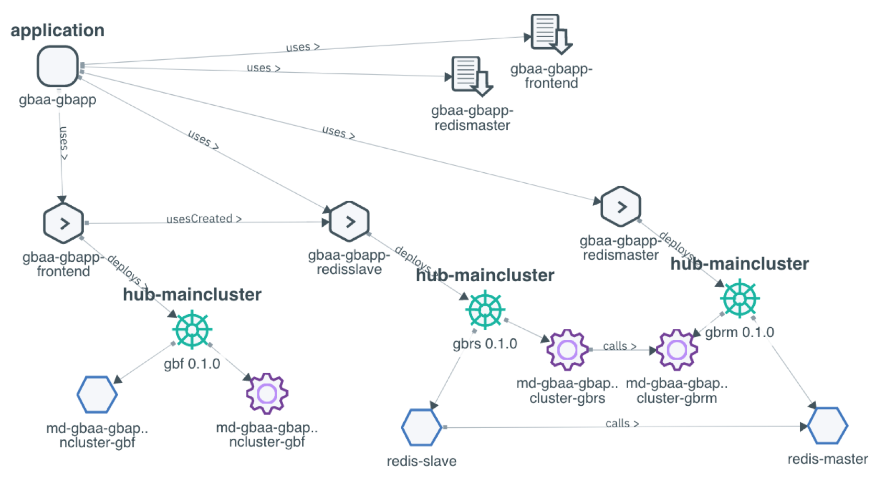

# MCM Resource and App Placement
Your environment might have a different setting, please modify the namespace and cluster name

## Cluster Image Policy
Starting with ICP 3.1.2, there is a CLuster Image Policy.

```
[root@icp3m1 mcm_app]# kg ClusterImagePolicy
NAME                                    AGE
ibmcloud-default-cluster-image-policy   5d
[root@icp3m1 mcm_app]# kd ClusterImagePolicy ibmcloud-default-cluster-image-policy
Name:         ibmcloud-default-cluster-image-policy
Namespace:    
Labels:       <none>
Annotations:  <none>
API Version:  securityenforcement.admission.cloud.ibm.com/v1beta1
Kind:         ClusterImagePolicy
Metadata:
  Creation Timestamp:  2019-03-21T14:36:17Z
  Generation:          1
  Resource Version:    3696
  Self Link:           /apis/securityenforcement.admission.cloud.ibm.com/v1beta1/clusterimagepolicies/ibmcloud-default-cluster-image-policy
  UID:                 afbb4183-4be6-11e9-9b8c-005056a534f0
Spec:
  Repositories:
    Name:  cemcluster.icp:8500/*
    Name:  registry.bluemix.net/ibm/*
    Name:  cp.icr.io/cp/*
    Name:  docker.io/apache/couchdb*
    Name:  docker.io/ppc64le/*
    Name:  docker.io/amd64/busybox*
    Name:  docker.io/vault:*
    Name:  docker.io/consul:*
    Name:  docker.io/python:*
    Name:  docker.io/centos:*
    Name:  docker.io/postgres:*
    Name:  docker.io/hybridcloudibm/*
    Name:  docker.io/ibmcom/*
    Name:  docker.io/db2eventstore/*
    Name:  docker.io/icpdashdb/*
    Name:  docker.io/store/ibmcorp/*
    Name:  docker.io/alpine*
    Name:  docker.io/busybox*
    Name:  docker.io/dduportal/bats:*
    Name:  docker.io/cassandra:*
    Name:  docker.io/haproxy:*
    Name:  docker.io/hazelcast/hazelcast:*
    Name:  docker.io/library/busybox:*
    Name:  docker.io/minio/minio:*
    Name:  docker.io/nginx:*
    Name:  docker.io/open-liberty:*
    Name:  docker.io/openwhisk/*
    Name:  docker.io/rabbitmq:*
    Name:  docker.io/radial/busyboxplus:*
    Name:  docker.io/ubuntu*
    Name:  docker.io/websphere-liberty:*
    Name:  docker.io/wurstmeister/kafka:*
    Name:  docker.io/zookeeper:*
    Name:  docker.io/ibmcloudcontainers/strongswan:*
    Name:  docker.io/opsh2oai/dai-ppc64le:*
    Name:  docker.io/redis*
    Name:  docker.io/f5networks/k8s-bigip-ctlr:*
    Name:  docker.io/rook/rook:*
    Name:  docker.io/rook/ceph:*
    Name:  docker.io/couchdb:*
    Name:  docker.elastic.co/beats/filebeat:*
    Name:  docker.io/prom/statsd-exporter:*
    Name:  docker.elastic.co/elasticsearch/elasticsearch:*
    Name:  docker.elastic.co/kibana/kibana:*
    Name:  docker.elastic.co/logstash/logstash:*
    Name:  quay.io/k8scsi/csi-attacher:*
    Name:  quay.io/k8scsi/driver-registrar:*
    Name:  quay.io/k8scsi/nfsplugin:*
    Name:  quay.io/kubernetes-multicluster/federation-v2:*
    Name:  k8s.gcr.io/hyperkube:*
    Name:  registry.bluemix.net/armada-master/ibm-worker-recovery:*
Events:    <none>
```
For this lab exercise, we will need to use the app that will be pulled from public repositories. So we need to allow by adding an open image policy.  Do not do this for production environment.

```
[root@icp1m1 ~]# cat imagepolicy.yaml
apiVersion: securityenforcement.admission.cloud.ibm.com/v1beta1
kind: ClusterImagePolicy
metadata:
  name: mcm
spec:
  repositories:
  - name: "*/*"
    policy:
      va:
        enabled: false

[root@icp1m1 ~]# kubectl apply -f imagepolicy.yaml
clusterimagepolicy.securityenforcement.admission.cloud.ibm.com/mcm created
```

After applying you should have something similar to this:
```
[root@icp3m1 mcm_app]# kg ClusterImagePolicy
NAME                                    AGE
ibmcloud-default-cluster-image-policy   5d
mcm                                     51s


[root@icp3m1 mcm_app]# kd ClusterImagePolicy mcm
Name:         mcm
Namespace:    
Labels:       <none>
Annotations:  kubectl.kubernetes.io/last-applied-configuration:
                {"apiVersion":"securityenforcement.admission.cloud.ibm.com/v1beta1","kind":"ClusterImagePolicy","metadata":{"annotations":{},"name":"mcm"}...
API Version:  securityenforcement.admission.cloud.ibm.com/v1beta1
Kind:         ClusterImagePolicy
Metadata:
  Creation Timestamp:  2019-03-27T10:12:18Z
  Generation:          1
  Resource Version:    831966
  Self Link:           /apis/securityenforcement.admission.cloud.ibm.com/v1beta1/clusterimagepolicies/mcm
  UID:                 cda1cddc-5078-11e9-9056-005056a534f0
Spec:
  Repositories:
    Name:  */*
    Policy:
      Va:
        Enabled:  false
Events:           <none>
[root@icp3m1 mcm_app]# 
```
## GuessBook Application.
Git Clone the GuessBook github
https://github.ibm.com/CASE/refarch-mcm - guessbook readme.md

We need the following:
- The actual deployment, specifying the helm chart: Define 3 depoyables
- The application definition, including the applicationrelationships:
  - 1 application definition
  - 3 applicationrelationship definition
    - From Application to FrontEnd PHP
    - From Application to RedisMaster
    - From FrontEndPHP to RedisSlave
- PlacementPolicy and PlacementBinding.
  - A pair for the FrontEnd
  - A pair for the RedisMaster (remember RedisSlave is a HA component).
  - Placement Policy : Contains the Actual decision where to place
  - Placement Binding: Bind the Policy to the current instance.

We put all of this in a yaml file: gbapp_demo.yaml

Open the yaml file, and notice the placement policy and placement binding.

## Deploy the yaml file.

Apply the yaml file.

```
kubectl apply -f gbapp_demo.yaml
```

To check the effect you can run the following command:
```
mcmctl get application
mcmctl get deployable
mcmctl get placementpolicy
mcmctl get placementbinding
mcmctl get applicationrelationship
```

For example:
```
[root@icp1m1 ~]# mcmctl get application
NAME         AGE
gbaa-gbapp   3m

[root@icp1m1 ~]# mcmctl get deployable
NAME                     DEPLOYER   AGE       DETAILS
gbaa-gbapp-frontend      helm       3m        ChartURL:https://raw.githubusercontent.com/abdasgupta/helm-repo/master/3.1-mcm-guestbook/gbf-0.1.0.tgz
gbaa-gbapp-redismaster   helm       3m        ChartURL:https://raw.githubusercontent.com/abdasgupta/helm-repo/master/3.1-mcm-guestbook/gbrm-0.1.0.tgz
gbaa-gbapp-redisslave    helm       3m        ChartURL:https://raw.githubusercontent.com/abdasgupta/helm-repo/master/3.1-mcm-guestbook/gbrs-0.1.0.tgz

[root@icp1m1 ~]# mcmctl get placementpolicy
NAME                     REPLICAS   ORDERBY   DECISIONS         AGE
gbaa-gbapp-frontend      1          cpu()     hub-maincluster   3m
gbaa-gbapp-redismaster   1          cpu()     hub-maincluster   3m

[root@icp1m1 ~]# mcmctl get placementbinding
NAME                     PLACEMENTPOLICY          SUBJECTS                                         AGE
gbaa-gbapp-frontend      gbaa-gbapp-frontend      gbaa-gbapp-frontend(Deployable.mcm.ibm.com)      3m
gbaa-gbapp-redismaster   gbaa-gbapp-redismaster   gbaa-gbapp-redismaster(Deployable.mcm.ibm.com)   3m

[root@icp1m1 ~]# mcmctl get applicationrelationship
NAME                     TYPE          SOURCE                            DESTINATION                          AGE
gbaa-gbapp-appfrontend   contains      gbaa-gbapp(Application)           gbaa-gbapp-frontend(Deployable)      3m
gbaa-gbapp-appmaster     contains      gbaa-gbapp(Application)           gbaa-gbapp-redismaster(Deployable)   3m
gbaa-gbapp-slave         usesCreated   gbaa-gbapp-frontend(Deployable)   gbaa-gbapp-redisslave(Deployable)    3m
[root@icp1m1 ~]# 
```
## Work with application
Bring the MCM Web Interface, and choose the application menu. The application should be listed.


Click on the `Launch Health View` link, this should take you to the Grafana dashboard created automatically by MCM:


Go back to the application list view, and click the application name itself, Click the `Diagram` menu.


Switch back to the ICP view (Local Cluster) and bring up the deployment menu.


Click on the `launch` link.  You should be able to view and interact with the application itself.


## Place the application to the other cluster
Go back to the application deployment view, and go to the section that show the placement selection, select the edit menu.  You are presented with the yaml editor mode, edit the placement selection with the label that show the other cluster.  Edit both placement.


Notice the cluster selected now should show the other cluster.


Go to the ICP interface of the other cluster, and as before select the deployment, and launch the application.  YOu can verify that the application is now running on the other cluster.
